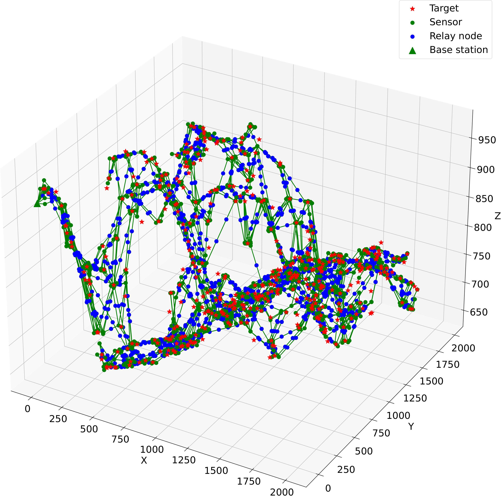

# SPARTA-GEMSTONE: A two-phase approach for efficient node placement in 3D wireless sensor networks under $Q$-Coverage and $Q$-Connectivity constraints

This repository is the official implementation of the graduation thesis:

Truong Vu, *SPARTA-GEMSTONE: A two-phase approach for efficient node placement in 3D wireless sensor networks under Q-Coverage and Q-Connectivity constraints*.

[[Thesis](Media/thesis.pdf)][[Slides](Media/slides.pptx)]


<p align="center">Result of SPARTA-CC-GEMSTONE with the default setting.</p>

## 1. Clone the repository

Now please clone the repository and switch to the root directory:
```console
git clone git@github.com:truong2710-cyber/SPARTA-GEMSTONE.git /your/path/sparta_gemstone
cd /your/path/sparta_gemstone
```


## 2. Environment setup
We recommend start from a fresh Python environment and install the required packages to avoid incompatibility issues. For instance, you can create a new environment in Anaconda and switch to it:
```console
conda create -n sparta_gemstone
conda deactivate && conda activate sparta_gemstone
```
In the environment, run the following command to install necessary packages:
```console
pip install -r requirements.txt
```
## 3. Run experiments
We provide some arguments for the experiments as follows:
- `--N`: number of targets, default = $400$.
- `--qm`: maximum value of $Q$ for every target, default = $10$.
- `--rs`: sensing range, default =  $40 (m)$.
- `--rc`: communication range, default = $80 (m)$.
- `--d`: dataset name, which is in the list `["bacgiang", "hanoi", "lamdong", "sonla", "thaibinh"]`, default = `sonla`.
- `--w`: the width (also the length) of the AoI, default = $2000(m)$.
- `--b`: base station location in xy-coordinate, default = `0 0`.
- `--ch`: which factor to change. There are four options `['n', 'Rs', 'Q', 'Rc']`, default = `n`.
- `--s`: the step of the change, default = $15$.
- `--ns`: the number of steps to take, default = $6$.
- `--nr`: the number of runs in one data config, default = $20$.
- `--p1`: the algorithm to use in phase I, default = `sparta_cc`. There are three options `['sparta', 'sparta_cc', 'sparta_cp']`.
- `--p2`: the algorithm to use in phase II, default = `gemstone`. There are two options `['gemstone', 'cmfa']`.

Run file `main.py` to execute the experiment. For example:
```console
python main.py --N 400 --qm 10 --rs 40 --rc 80 --d sonla --w 2000 --b 0 0 --ch n --s 15 --ns 6 --nr 20 --p1 sparta p2 gemstone
```
The result is saved in the folder `Result/dataset_name/algo_name` in a `.txt` file.